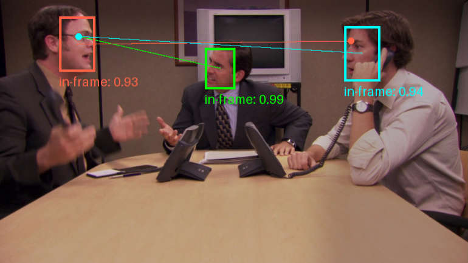
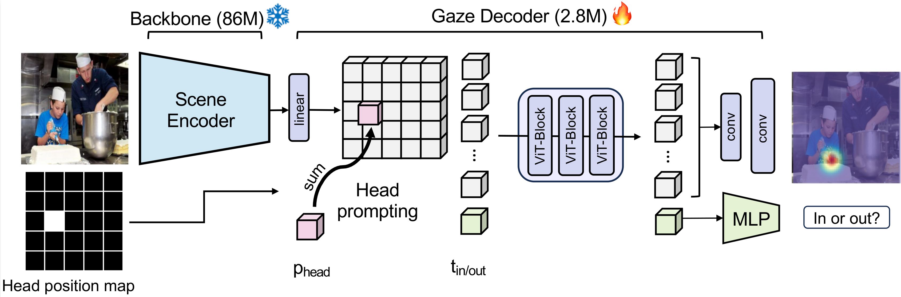

# Gaze-LLE
<div style="text-align:center;">
    
    
    
    
</div>

[Gaze-LLE: Gaze Target Estimation via Large-Scale Learned Encoders](https://arxiv.org/abs/2412.09586) \
[Fiona Ryan](https://fkryan.github.io/), Ajay Bati, [Sangmin Lee](https://sites.google.com/view/sangmin-lee), [Daniel Bolya](https://dbolya.github.io/), [Judy Hoffman](https://faculty.cc.gatech.edu/~judy/)\*, [James M. Rehg](https://rehg.org/)\*


This is the official implementation for Gaze-LLE, a transformer approach for estimating gaze targets that leverages the power of pretrained visual foundation models. Gaze-LLE provides a streamlined gaze architecture that learns only a lightweight gaze decoder on top of a frozen, pretrained visual encoder (DINOv2). Gaze-LLE learns 1-2 orders of magnitude fewer parameters than prior works and doesn't require any extra input modalities like depth and pose!

<div style="text-align:center;">
    
</div>


## Installation

Clone this repo, then create the virtual environment.
```
conda env create -f environment.yml
conda activate gazelle
pip install -e .
```
If your system supports it, consider installing [xformers](https://github.com/facebookresearch/xformers) to speed up attention computation.
```
pip3 install -U xformers --index-url https://download.pytorch.org/whl/cu118
```

## Pretrained Models

We provide the following pretrained models for download.
| Name | Backbone type | Backbone name | Training data | Checkpoint |
| ---- | ------------- | ------------- |-------------- | ---------- |
| ```gazelle_dinov2_vitb14``` | DINOv2 ViT-B | ```dinov2_vitb14```| GazeFollow | [Download](https://github.com/fkryan/gazelle/releases/download/v1.0.0/gazelle_dinov2_vitb14.pt) |
| ```gazelle_dinov2_vitl14``` | DINOv2 ViT-L | ```dinov2_vitl14``` | GazeFollow | [Download](https://github.com/fkryan/gazelle/releases/download/v1.0.0/gazelle_dinov2_vitl14.pt) |
| ```gazelle_dinov2_vitb14_inout``` | DINOv2 ViT-B | ```dinov2_vitb14``` | Gazefollow -> VideoAttentionTarget | [Download](https://github.com/fkryan/gazelle/releases/download/v1.0.0/gazelle_dinov2_vitb14_inout.pt) |
| ```gazelle_large_vitl14_inout``` | DINOv2-ViT-L | ```dinov2_vitl14```  | GazeFollow -> VideoAttentionTarget | [Download](https://github.com/fkryan/gazelle/releases/download/v1.0.0/gazelle_dinov2_vitl14_inout.pt) |


Note that our Gaze-LLE checkpoints contain only the gaze decoder weights - the DINOv2 backbone weights are downloaded from ```facebookresearch/dinov2``` on PyTorch Hub when the Gaze-LLE model is created in our code.

The GazeFollow-trained models output a spatial heatmap of gaze locations over the scene with values in range ```[0,1]```, where 1 represents the highest probability of the location being a gaze target. The models that are additionally finetuned on VideoAttentionTarget also predict a in/out of frame gaze score in range ```[0,1]``` where 1 represents the person's gaze target being in the frame.

### PyTorch Hub

The models are also available on PyTorch Hub for easy use without installing from source.
```
model, transform = torch.hub.load('fkryan/gazelle', 'gazelle_dinov2_vitb14')
model, transform = torch.hub.load('fkryan/gazelle', 'gazelle_dinov2_vitl14')
model, transform = torch.hub.load('fkryan/gazelle', 'gazelle_dinov2_vitb14_inout')
model, transform = torch.hub.load('fkryan/gazelle', 'gazelle_dinov2_vitl14_inout')
```


## Usage
### Colab Demo Notebook
Check out our [Demo Notebook](https://colab.research.google.com/drive/1TSoyFvNs1-au9kjOZN_fo5ebdzngSPDq?usp=sharing) on Google Colab for how to detect gaze for all people in an image.

### Gaze Prediction
Gaze-LLE is set up for multi-person inference (e.g. for a single image, GazeLLE encodes the scene only once and then uses the features to predict the gaze of multiple people in the image). The input is a batch of image tensors and a list of bounding boxes for each image representing the heads of the people to predict gaze for in each image. The bounding boxes are tuples of form ```(xmin, ymin, xmax, ymax)``` and are in ```[0,1]``` normalized image coordinates. Below we show how to perform inference for a single person in a single image.
```
from PIL import Image
import torch
from gazelle.model import get_gazelle_model

model, transform = get_gazelle_model("gazelle_dinov2_vitl14_inout")
model.load_gazelle_state_dict(torch.load("/path/to/checkpoint.pt", weights_only=True))
model.eval()

device = "cuda" if torch.cuda.is_available() else "cpu"
model.to(device)

image = Image.open("path/to/image.png").convert("RGB")
input = {
    "images": transform(image).unsqueeze(dim=0).to(device),    # tensor of shape [1, 3, 448, 448]
    "bboxes": [[(0.1, 0.2, 0.5, 0.7)]]              # list of lists of bbox tuples
}

with torch.no_grad():
    output = model(input)
predicted_heatmap = output["heatmap"][0][0]        # access prediction for first person in first image. Tensor of size [64, 64]
predicted_inout = output["inout"][0][0]            # in/out of frame score (1 = in frame) (output["inout"] will be None  for non-inout models)
```
We empirically find that Gaze-LLE is effective without a bounding box input for scenes with just one person. However, providing a bounding box can improve results, and is necessary for scenes with multiple people to specify which person's gaze to estimate. To inference without a bounding box, use None in place of a bounding box tuple in the bbox list (e.g. ```input["bboxes"] = [[None]]``` in the example above).


We also provide a function to visualize the predicted heatmap for an image.
```
import matplotlib.pyplot as plt
from gazelle.utils import visualize_heatmap

viz = visualize_heatmap(image, predicted_heatmap)
plt.imshow(viz)
plt.show()
```


## Evaluate
We provide evaluation scripts for GazeFollow and VideoAttentionTarget below to reproduce our results from our checkpoints.
### GazeFollow
Download the GazeFollow dataset [here](https://github.com/ejcgt/attention-target-detection?tab=readme-ov-file#dataset). We provide a preprocessing script ```data_prep/preprocess_gazefollow.py```, which preprocesses and compiles the annotations into a JSON file for each split within the dataset folder. Run the preprocessing script as
```
python data_prep/preprocess_gazefollow.py --data_path /path/to/gazefollow/data_new
```
Download the pretrained model checkpoints above and use ```--model_name``` and ```ckpt_path``` to specify the model type and checkpoint for evaluation.

```
python scripts/eval_gazefollow.py
    --data_path /path/to/gazefollow/data_new \
    --model_name gazelle_dinov2_vitl14 \
    --ckpt_path /path/to/checkpoint.pt \
    --batch_size 128
```


### VideoAttentionTarget
Download the VideoAttentionTarget dataset [here](https://github.com/ejcgt/attention-target-detection?tab=readme-ov-file#dataset-1). We provide a preprocessing script ```data_prep/preprocess_vat.py```, which preprocesses and compiles the annotations into a JSON file for each split within the dataset folder. Run the preprocessing script as
```
python data_prep/preprocess_gazefollow.py --data_path /path/to/videoattentiontarget
```
Download the pretrained model checkpoints above and use ```--model_name``` and ```ckpt_path``` to specify the model type and checkpoint for evaluation.
```
python scripts/eval_vat.py
    --data_path /path/to/videoattentiontarget \
    --model_name gazelle_dinov2_vitl14_inout \
    --ckpt_path /path/to/checkpoint.pt \
    --batch_size 64
```

## Citation

```
@article{ryan2024gazelle,
  author       = {Ryan, Fiona and Bati, Ajay and Lee, Sangmin and Bolya, Daniel and Hoffman, Judy and Rehg, James M},
  title        = {Gaze-LLE: Gaze Target Estimation via Large-Scale Learned Encoders},
  journal      = {arXiv preprint arXiv:2412.09586},
  year         = {2024},
}
```

## References

- Our models are built on top of pretrained DINOv2 models from PyTorch Hub ([Github repo](https://github.com/facebookresearch/dinov2)).

- Our GazeFollow and VideoAttentionTarget preprocessing code is based on [Detecting Attended Targets in Video](https://github.com/ejcgt/attention-target-detection).

- We use [PyTorch Image Models (timm)](https://github.com/huggingface/pytorch-image-models) for our transformer implementation.

- We use [xFormers](https://github.com/facebookresearch/xformers) for efficient multi-head attention.
